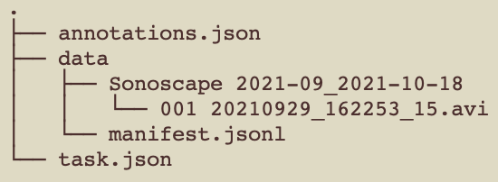
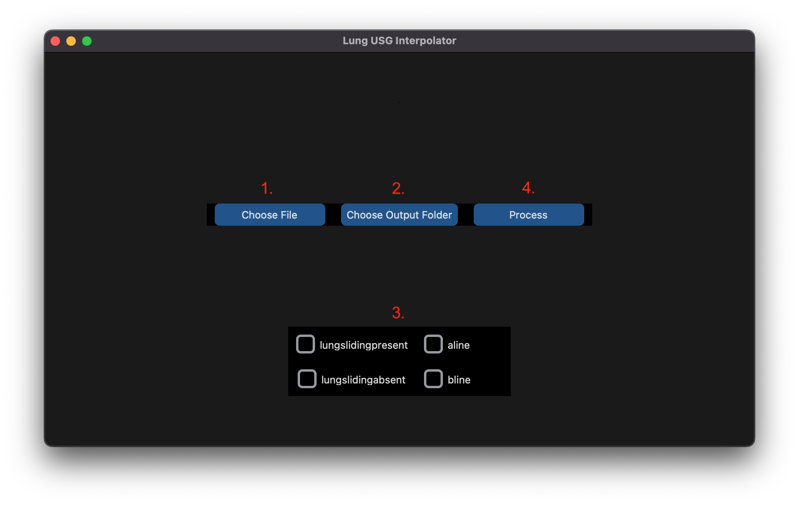

# Lung USG artifacts interpolator

## Installation

1. Create a virtual environment
2. Install requirements using `pip install -r requirements.txt`

## Running

### Input format
Program awaits .zip file which has been generated as a backup of a task from the CVAT software.
This archive should have the following structure:

### Output format
Program outputs an archive with the same structure but with the new annotations.json file.
This archive can be imported into CVAT software as a backup of a task.

### Instructions
1. Run `main.py`
2. Choose a file (or multiple files)
3. Choose an output folder
4. Check which atrifacts you want to interpolate
5. Click **Process**

## Screeshot

